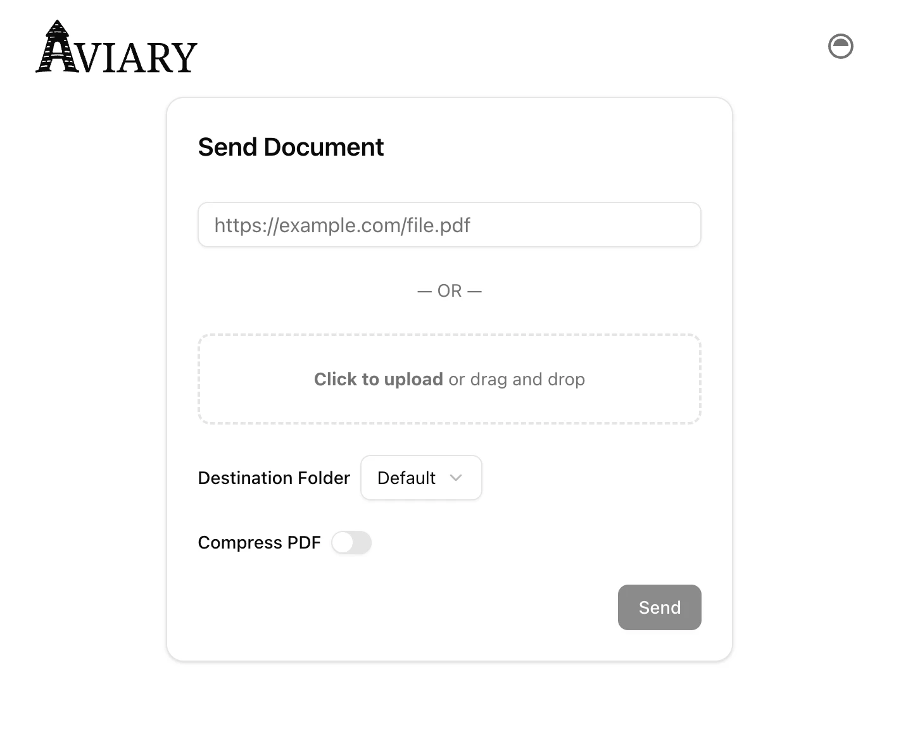

<p align="left">
  <picture>
    <source
      srcset="assets/logo-dark.svg"
      media="(prefers-color-scheme: dark)"
    >
    
  </picture>
</p>

A webhook-driven document uploader for reMarkable, featuring a static Next.js + ShadCN UI and a Go backend that processes and pushes documents to your device. Compatible with both reMarkable Cloud and [rmfakecloud](https://github.com/ddvk/rmfakecloud) via [rmapi](https://github.com/ddvk/rmapi).

## Why the Name?

**Aviary** is a place where birds are kept, chosen to evoke sending documents into the clouds using avian couriers. 

## Features

- Webhook endpoint (`/api/webhook`) for SMS or HTTP integrations (e.g. Twilio)
- Automatic PDF download with a real-browser User-Agent
- Automatic conversion of PNG and JPEG images to PDF
- Optional Ghostscript compression
- Two upload modes:
  - **Simple**: upload the raw PDF  
  - **Managed**: rename by date, upload, then append the year locally & clean up files older than 7 days
- Clean web UI for uploading of documents by URL or from the local filesystem

## Screenshot

  <picture>
    <source
      srcset="assets/screenshot-dark.webp"
      media="(prefers-color-scheme: dark)"
    >
    
  </picture>

## Environment Variable Configuration

### Core Configuration
| Variable                 | Required? | Default | Description |
|--------------------------|-----------|---------|-------------|
| DISABLE_UI               | No        | false   | Set `true` to disable the UI routes and run in API-only mode |
| PDF_DIR                  | No        | /app/pdfs| Directory to archive PDFs into |
| RMAPI_HOST               | No        |         | Self-hosted endpoint to use for rmapi |
| RM_TARGET_DIR            | No        | /       | Target folder on reMarkable device |
| GS_COMPAT                | No        | 1.4     | Ghostscript compatibility level |
| GS_SETTINGS              | No        | /ebook  | Ghostscript PDFSETTINGS preset |
| SNIFF_TIMEOUT            | No        | 5s      | Timeout for sniffing the MIME type |
| DOWNLOAD_TIMEOUT         | No        | 1m      | Timeout for Download requests |

For more rmapi-specific configuration, see [their documentation](https://github.com/ddvk/rmapi?tab=readme-ov-file#environment-variables).

### Authentication (Optional)
| Variable                 | Required? | Default | Description |
|--------------------------|-----------|---------|-------------|
| AUTH_USERNAME            | No        |         | Username for web UI login (requires AUTH_PASSWORD) |
| AUTH_PASSWORD            | No        |         | Password for web UI login (requires AUTH_USERNAME) |
| API_KEY                  | No        |         | Secret key for API access via Authorization header |
| JWT_SECRET               | No        | auto-generated | Custom JWT signing secret (auto-generated if not provided) |
| ALLOW_INSECURE           | No        |  false  | Set to `true` to allow non-secure cookies (not recommended) |

## Authentication

Aviary supports optional authentication to protect your instance:

### Web UI Authentication
Set both `AUTH_USERNAME` and `AUTH_PASSWORD` to enable login-protected web interface:
```bash
AUTH_USERNAME=myuser
AUTH_PASSWORD=mypassword
```

### API Key Authentication  
Set `API_KEY` to enable programmatic access to API endpoints:
```bash
API_KEY=your-secret-api-key-here
```

Use the API key in requests with either header:
- `Authorization: Bearer your-api-key`
- `X-API-Key: your-api-key`

### Flexible Authentication
- **No auth**: If neither UI nor API auth is configured, all endpoints are open
- **UI only**: Set `AUTH_USERNAME` + `AUTH_PASSWORD` to protect web interface only
- **API only**: Set `API_KEY` to protect API endpoints only  
- **Both**: Set all three to enable both authentication methods
- **API endpoints accept either**: Valid API key OR valid web login session

## Webhook POST parameters
| Parameter                | Required? | Example | Description |
|--------------------------|-----------|---------|-------------|
| Body                     | Yes       | https://pdfobject.com/pdf/sample.pdf | URL to PDF to download
| prefix                   | No        | Reports     | Folder and file-name prefix, only used if `manage` is also `true` |
| compress                 | No        | true/false  | Run Ghostscript compression |
| manage                   | No        | true/false  | Enable managed handling (renaming and cleanup) |
| archive                  | No        | true/false  | Download to PDF_DIR instead of /tmp |
| rm_dir                   | No        | Books       | Override default reMarkable upload directory |
| retention_days           | No        | 30          | Optional integer (in days) for cleanup if manage=true. Defaults to 7. |

### Example cURL
```shell
# Basic request
curl -X POST http://localhost:8000/api/webhook \
  -d "Body=https://pdfobject.com/pdf/sample.pdf" \
  -d "prefix=Reports" \
  -d "compress=true" \
  -d "manage=true" \
  -d "rm_dir=Books"

# With API key authentication
curl -X POST http://localhost:8000/api/webhook \
  -H "Authorization: Bearer your-api-key" \
  -d "Body=https://pdfobject.com/pdf/sample.pdf" \
  -d "compress=true"

# Alternative API key header
curl -X POST http://localhost:8000/api/webhook \
  -H "X-API-Key: your-api-key" \
  -d "Body=https://pdfobject.com/pdf/sample.pdf"
```
## Integrations

* [AWS SES](https://github.com/rmitchellscott/aviary-integration-ses) - Lambda to provide emailed PDFs/ePubs to Aviary.


# Examples
The following examples are provided as a way to get started. Some adjustments may be required before production use, particularly regarding secret management.

## Set Up 
1. Get your device and user token file (rmapi.conf) from the reMarkable cloud by running the following command and entering the one-time code: `docker run -it -e RMAPI_HOST=remarkable.mydomain.com ghcr.io/rmitchellscott/aviary pair`
1. Save the output as rmapi.conf, and this will get mounted into the container.


## Docker
```shell
# Basic usage
docker run -d \
-p 8000:8000 \
-v ~/rmapi.conf:/root/.config/rmapi/rmapi.conf \
ghcr.io/rmitchellscott/aviary

# With authentication
docker run -d \
-p 8000:8000 \
-e AUTH_USERNAME=myuser \
-e AUTH_PASSWORD=mypassword \
-e API_KEY=your-secret-api-key \
-v ~/rmapi.conf:/root/.config/rmapi/rmapi.conf \
ghcr.io/rmitchellscott/aviary
```

## Docker Compose

```yaml
services:
  aviary:
    image: ghcr.io/rmitchellscott/aviary
    ports:
      - "8000:8000"
    environment:
      RMAPI_HOST: "${RMAPI_HOST}"
      # Optional authentication (uncomment to enable):
      # AUTH_USERNAME: "${AUTH_USERNAME}"
      # AUTH_PASSWORD: "${AUTH_PASSWORD}"
      # API_KEY: "${API_KEY}"
    volumes:
      - type: bind
        source: ~/rmapi.conf
        target: /root/.config/rmapi/rmapi.conf
    restart: unless-stopped
```

## Building Locally
### Requirements

- [Ghostscript](https://www.ghostscript.com/) (`gs` CLI)
- [ImageMagick](https://imagemagick.org/)
- [npm]()
- [rmapi](https://github.com/ddvk/rmapi) (must be installed & in your `$PATH`)
- Access to your reMarkable credentials (`rmapi` setup)

Ensure the requirements are installed and available in your PATH.
```shell
go generate # Generate the Next.js static front-end
go build -o aviary
```
