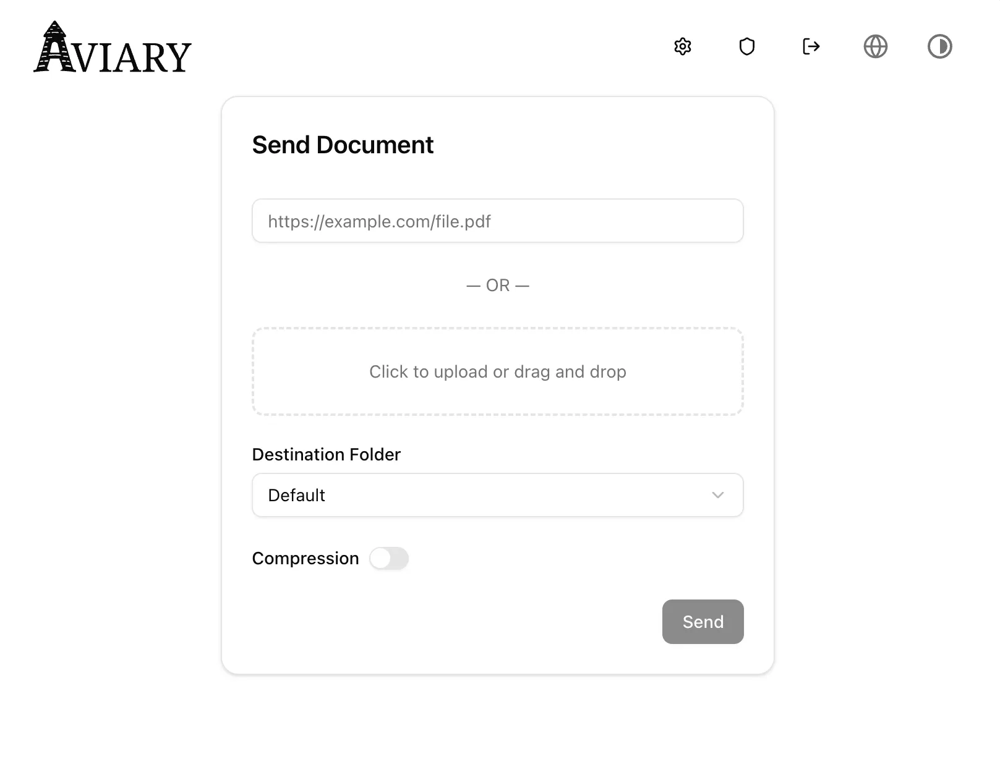

<p align="left">
  <picture>
    <source
      srcset="assets/logo-dark.svg"
      media="(prefers-color-scheme: dark)"
    >
    
  </picture>
</p>

A webhook-driven document uploader for reMarkable, featuring a static Next.js + ShadCN UI and a Go backend that processes and pushes documents to your device. Compatible with both reMarkable Cloud and [rmfakecloud](https://github.com/ddvk/rmfakecloud) via [rmapi](https://github.com/ddvk/rmapi).

## Features

- Webhook endpoint (`/api/webhook`) for SMS or HTTP integrations (e.g. Twilio)
- Automatic PDF download with a real-browser User-Agent
- Optional Ghostscript compression
- Two upload modes:
  - **Simple**: upload the raw PDF  
  - **Managed**: rename by date, upload, then append the year locally & clean up files older than 7 days
- Clean web UI for uploading of documents by URL

## Screenshot

  <picture>
    <source
      srcset="assets/screenshot-dark.webp"
      media="(prefers-color-scheme: dark)"
    >
    
  </picture>

## Requirements

- [Ghostscript](https://www.ghostscript.com/) (`gs` CLI)
- [rmapi](https://github.com/ddvk/rmapi) (must be installed & in your `$PATH`)
- Access to your reMarkable credentials (`rmapi` setup)

## Environment Variable Configuration

| Variable                 | Required? | Default | Description |
|--------------------------|-----------|---------|-------------|
| PDF_DIR                  | No        | /app/pdfs| Directory to archive PDFs into |
| RMAPI_HOST               | No        |         | Self-hosted endpoint to use for rmapi |
| RM_TARGET_DIR            | No        | /       | Target folder on reMarkable device |
| GS_COMPAT                | No        | 1.4     | Ghostscript compatibility level |
| GS_SETTINGS              | No        | /ebook  | Ghostscript PDFSETTINGS preset |

For more rmapi-specific configuration, see [their documentation](https://github.com/ddvk/rmapi?tab=readme-ov-file#environment-variables).


## Webhook POST parameters
| Parameter                | Required? | Example | Description |
|--------------------------|-----------|---------|-------------|
| Body                     | Yes       | https://pdfobject.com/pdf/sample.pdf | URL to PDF to download
| prefix                   | No        | Reports     | Folder and file-name prefix, only used if `manage` is also `true` |
| compress                 | No        | true/false | Run Ghostscript compression |
| manage                   | No        | true/false | Enable managed handling (renaming and cleanup) |
| archive                  | No        | true/false | Download to PDF_DIR instead of /tmp |
| rm_dir                   | No        | Books | Override default reMarkable upload directory |

### Example cURL
```shell
curl -X POST http://localhost:8000/api/webhook \
  -d "Body=https://pdfobject.com/pdf/sample.pdf" \
  -d "prefix=Reports" \
  -d "compress=true" \
  -d "manage=true" \
  -d "rm_dir=Books"
```

# Examples
The following examples are provided as a way to get started. Some adjustments may be required before production use, particularly regarding secret management.

## Set Up 
1. Get your device and user token file (rmapi.conf) from the Remarkable cloud by running the following command and entering the one-time code: `docker run -it -e RMAPI_HOST=remarkable.mydomain.com ghcr.io/rmitchellscott/aviary pair`
1. Save the output as rmapi.conf, and this will get mounted into the container.


## Docker
```shell
docker run -d \
-p 8000:8000 \
-v ~/rmapi.conf:/root/.config/rmapi/rmapi.conf \
ghcr.io/rmitchellscott/aviary
```

## Docker Compose

```yaml
verion: 2.4

services:
  webhook2remarkable:
    image: ghcr.io/rmitchellscott/aviary
    ports:
      - "8000:8000"
    volumes:
      - type: bind
        source: ~/rmapi.conf
        target: /root/.config/rmapi/rmapi.conf
    restart: unless-stopped
```

## Building Locally

Ensure the requirements are installed and available in your PATH.
```shell
go generate # Generate the Next.js static front-end
go build -o aviary
```
